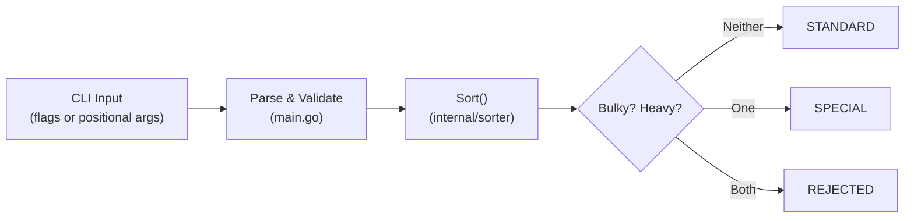

# package-sorter

## Summary

A Go CLI tool for a robotic automation factory that dispatches packages to the correct processing stack based on their dimensions and mass. Given a package's width, height, length, and mass, it returns one of three stacks: `STANDARD`, `SPECIAL`, or `REJECTED`.

## Table of Contents
- [Installation](#installation)
- [Usage](#usage)
- [Design](#design)
  - [API](#api)
  - [Components](#components)
  - [Data Flow](#data-flow)
- [Testing](#testing)

## Installation

_Dependencies_
| Dependency | Version |
|------------|---------|
| Go | 1.21+ |
| github.com/spf13/cobra | v1.10.2 |
| github.com/sirupsen/logrus | v1.9.4 |

```bash
git clone https://github.com/fpmoles/package-sorter.git
cd package-sorter
go mod download
go build -o package-sorter .
```

## Usage

Inputs are in centimeters (dimensions) and kilograms (mass). Arguments can be provided as positional args or named flags.

### Local binary

```bash
# Positional (width height length mass)
./package-sorter 10 10 10 5
# → STANDARD

# Named flags (any order)
./package-sorter --width 100 --height 100 --length 100 --mass 20
# → REJECTED

# Debug logging
./package-sorter --debug --width 150 --height 10 --length 10 --mass 5
# → SPECIAL
```

### Docker

```bash
# Build the image
docker build -t package-sorter .

# Positional (width height length mass)
docker run package-sorter 10 10 10 5
# → STANDARD

# Named flags (any order)
docker run package-sorter --width 100 --height 100 --length 100 --mass 20
# → REJECTED

# Debug logging
docker run package-sorter --debug --width 150 --height 10 --length 10 --mass 5
# → SPECIAL
```

**Stack dispatch rules:**

| Condition | Stack |
|-----------|-------|
| Not bulky and not heavy | `STANDARD` |
| Bulky or heavy (but not both) | `SPECIAL` |
| Both bulky and heavy | `REJECTED` |

A package is **bulky** if its volume ≥ 1,000,000 cm³ or any single dimension ≥ 150 cm.
A package is **heavy** if its mass ≥ 20 kg.

## Design

### API

```go
// Sort dispatches a package to the correct stack based on its dimensions and mass.
// Dimensions are in centimeters; mass is in kilograms.
// Returns an error if any input value is not positive.
func Sort(width, height, length, mass float64) (string, error)
```

Returns one of: `"STANDARD"`, `"SPECIAL"`, `"REJECTED"`, or an error for invalid (non-positive) input.

### Components

- **`main.go`** — CLI entry point using Cobra. Accepts input as positional args or named flags (`--width`, `--height`, `--length`, `--mass`). Supports `--debug` flag for verbose Logrus output.
- **`internal/sorter/`** — Core sorting logic. Stateless, pure function with no external dependencies.

### Data Flow



## Testing

```bash
# Download dependencies
go mod download

# Run all tests
go test ./...

# Run a specific test by name
go test -run TestSort/rejected_package ./internal/sorter/...

# Run with verbose output
go test -v ./internal/sorter/...
```

Test cases cover standard, heavy, bulky, and rejected packages; boundary values for each threshold; and invalid inputs (single field and all fields).
